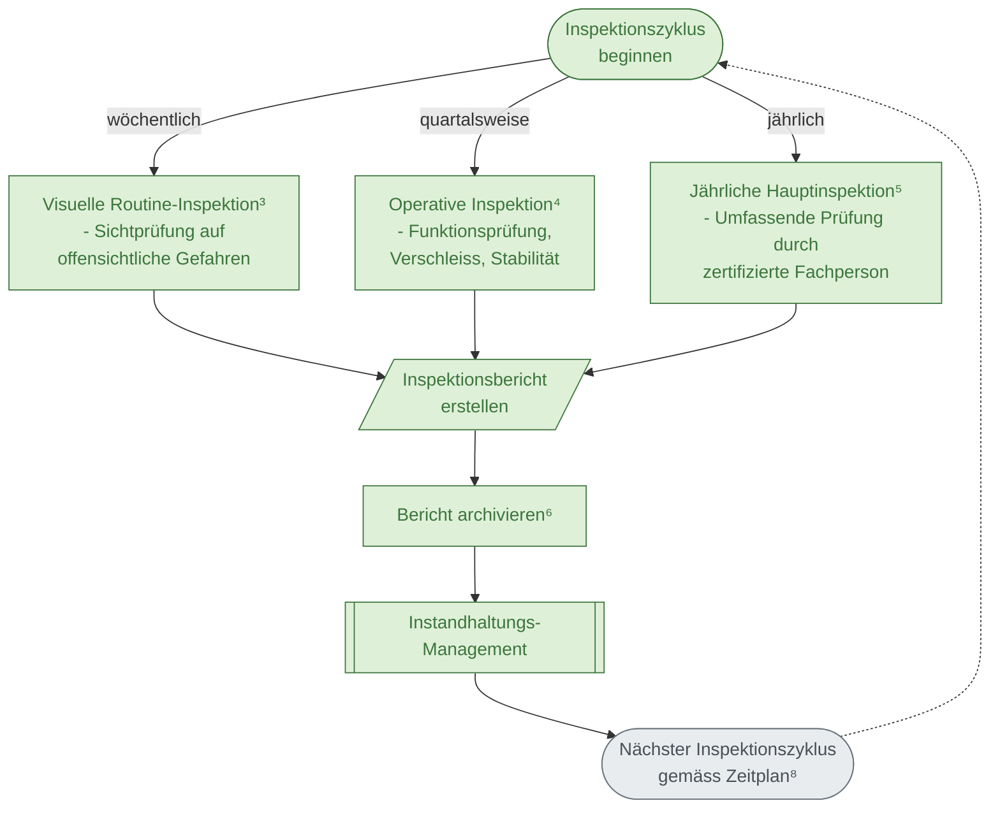

# Bestehender Spielplatz: Ablaufdiagramm

**Grundlage:** SN EN 1176-7:2020 – Anleitung für Installation, Inspektion, Wartung und Betrieb

**Zweck:** Dieses Flowchart zeigt den wiederkehrenden Inspektionszyklus für bestehende Spielplätze gemäss SN EN 1176-7. Es umfasst die drei Inspektionstypen, Berichterstattung, Archivierung und Instandhaltungs-Management.

---



---

## Fussnoten

**³ SN EN 1176-7, 6.1b** — Visuelle Routineinspektion

**⁴ SN EN 1176-7, 6.1c** — Operative Inspektion

**⁵ SN EN 1176-7, 6.1d** — Jährliche Hauptinspektion

**⁶ SN EN 1176-7, 8.2.2** — Dokumentationspflicht

**⁷ CEN/TR 17207** — Mängelklassifizierung (im Inspektionsbericht anzuwenden)

**⁸ SN EN 1176-7, 6.2.4** — Inspektionsplan

---

## Verwendung

Dieses Mermaid-Diagramm kann mit [Mermaid CLI](https://github.com/mermaid-js/mermaid-cli) in andere Formate konvertiert werden:

```bash
mmdc -i Bestehender-Spielplatz.md -o Bestehender-Spielplatz-mermaid.svg
mmdc -i Bestehender-Spielplatz.md -o Bestehender-Spielplatz-mermaid.png
```

Oder direkt in Markdown-Viewer mit Mermaid-Support (GitHub, GitLab, Obsidian, etc.) anzeigen.
