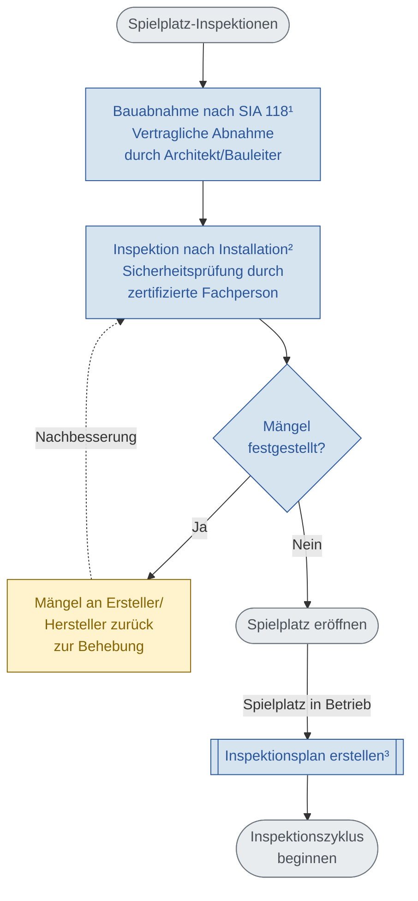

# Neuer Spielplatz: Ablaufdiagramm

**Grundlage:** SN EN 1176-7:2020 – Anleitung für Installation, Inspektion, Wartung und Betrieb

**Zweck:** Dieses Flowchart zeigt den Ablauf für die Inbetriebnahme eines neuen Spielplatzes gemäss SN EN 1176-7. Es umfasst Bauabnahme, Inspektion nach Installation, Mängelbehandlung und Übergang zum regulären Inspektionszyklus.

---



---

## Fussnoten

**¹ SIA 118** — Vertragliche Bauabnahme, ersetzt nicht die Sicherheitsinspektion

**² SN EN 1176-7, 6.1a** — Inspektion nach Installation

**³ SN EN 1176-7, 6.2.4** — Inspektionsplan

---

## Verwendung

Dieses Mermaid-Diagramm kann mit [Mermaid CLI](https://github.com/mermaid-js/mermaid-cli) in andere Formate konvertiert werden:

```bash
mmdc -i Neuer-Spielplatz.md -o Neuer-Spielplatz-mermaid.svg
mmdc -i Neuer-Spielplatz.md -o Neuer-Spielplatz-mermaid.png
```

Oder direkt in Markdown-Viewer mit Mermaid-Support (GitHub, GitLab, Obsidian, etc.) anzeigen.
