```mermaid
flowchart TD
    %% === STARTING FORK ===
    START(["Spielplatz-Inspektionen"])
    D01{"Neuer oder bestehender<br/>Spielplatz?"}

    START --> D01

    %% === NEUER SPIELPLATZ PATH (BLUE) ===
    N01["Bauabnahme nach SIA 118¹<br/>Vertragliche Abnahme<br/>durch Architekt/Bauleiter"]
    N02["Inspektion nach Installation²<br/>Sicherheitsprüfung durch<br/>zertifizierte Fachperson"]
    D02{"Mängel festgestellt?"}
    N03["Mängel an Ersteller/<br/>Hersteller zurück<br/>zur Behebung"]
    N04(["Spielplatz eröffnen"])
    IPLAN["Inspektionsplan erstellen"]

    D01 -->|"Neuer Spielplatz"| N01
    N01 --> N02
    N02 --> D02
    D02 -->|"Ja"| N03
    D02 -->|"Nein"| N04
    N03 -.->|"Nachbesserung"| N02
    N04 -->|"Spielplatz in Betrieb"| IPLAN
    IPLAN --> E00

    %% === INSPECTION CYCLE (GREEN) ===
    E00(["Inspektionszyklus<br/>beginnen"])
    E01["Sichtkontrolle³<br/>Sichtprüfung auf<br/>offensichtliche Gefahren"]
    E02["Funktionskontrolle⁴<br/>Funktionsprüfung,<br/>Verschleiss, Stabilität"]
    E03["Jahreshauptinspektion⁵<br/>Umfassende Prüfung durch<br/>zertifizierte Fachperson"]
    E04[/"Inspektionsbericht<br/>erstellen"/]

    D01 -->|"Bestehender Spielplatz"| E00
    E00 -->|"wöchentlich"| E01
    E00 -->|"quartalsweise"| E02
    E00 -->|"jährlich"| E03
    E01 --> E04
    E02 --> E04
    E03 --> E04

    %% === POST-INSPECTION PROCESS ===
    P01(["Bericht archivieren⁶"])
    IHM["Instandhaltungs-Management"]

    E04 --> P01
    E04 --> IHM

    %% === END (GRAY) ===
    END(["Nächster Inspektionszyklus<br/>gemäss Zeitplan⁸"])

    IHM --> END

    %% NOTE: CEN/TR 17207 annotation (not rendered as node, for documentation only)
    %% "Festgestellte Mängel sind im Bericht nach CEN/TR 17207⁷ zu klassifizieren"
    %% Connected to E04 via dashed line in draw.io

    %% === FOOTNOTE BOX ===
    FOOTNOTES["<b>Fussnoten</b><br/>¹ SIA 118 — Vertragliche Bauabnahme, ersetzt nicht die Sicherheitsinspektion<br/>² SN EN 1176-7, 6.1a — Inspektion nach Installation<br/>³ SN EN 1176-7, 6.1b — Visuelle Routineinspektion<br/>⁴ SN EN 1176-7, 6.1c — Operative Inspektion<br/>⁵ SN EN 1176-7, 6.1d — Jährliche Hauptinspektion<br/>⁶ SN EN 1176-7, 8.2.2 — Dokumentationspflicht<br/>⁷ CEN/TR 17207 — Mängelklassifizierung<br/>⁸ SN EN 1176-7, 6.2.4 — Inspektionsplan"]

    %% === LEGEND BOX ===
    LEGEND["<b>Legende</b><br/>▭ Rechteck = Prozessschritt / Aktion<br/>◇ Raute = Entscheidungspunkt<br/>⬭ Abgerundetes Rechteck = Start / Ende<br/>▱ Parallelogramm = Dokument / Bericht<br/><br/><b>Farben:</b><br/>(Blau) = Neuer Spielplatz<br/>(Grün) = Inspektionen<br/>(Gelb) = Mängel / Massnahmen<br/>(Grau) = Start / Ende"]

    END ~~~ FOOTNOTES
    FOOTNOTES ~~~ LEGEND

    %% === STYLING ===
    classDef startend fill:#E9ECEF,stroke:#6C757D,color:#495057
    classDef newpath fill:#D6E4F0,stroke:#2B579A,color:#2B579A
    classDef inspection fill:#DFF0D8,stroke:#3C763D,color:#3C763D
    classDef action fill:#FFF3CD,stroke:#856404,color:#856404
    classDef footnote fill:#F8F9FA,stroke:#DEE2E6,color:#495057

    class START,END,P01 startend
    class N01,N02,N03,N04,IPLAN newpath
    class E00,E01,E02,E03,E04 inspection
    class IHM action
    class FOOTNOTES,LEGEND footnote
```

# Spielplatz-Inspektionen: Ablaufdiagramm

**Grundlage:** SN EN 1176-7:2020 – Anleitung für Installation, Inspektion, Wartung und Betrieb

**Zweck:** Dieses Flowchart zeigt die Inspektionspflichten für neue und bestehende Spielplätze gemäss SN EN 1176-7. Es unterstützt Betreiber, Gemeinden und Eigentümer bei der Erfüllung ihrer Sorgfaltspflicht nach Art. 58 OR (Werkeigentümerhaftung).

---

---

## Node Count Verification

**Flow nodes:** 15
- Starting fork: START, D01 (2)
- Neuer Spielplatz path: N01, N02, D02, N03, N04, IPLAN (6)
- Inspection cycle: E00, E01, E02, E03, E04 (5)
- Post-inspection: P01, IHM, END (3)

**Note:** CEN/TR 17207 annotation is not counted as a flow node (annotation only in draw.io)

**Documentation nodes:** 2 (FOOTNOTES, LEGEND)

**Total nodes:** 17

## Edge Count Verification

**Total edges:** 19 flow edges
- Starting fork: 1 edge (START→D01)
- Neuer Spielplatz branch: 2 edges (D01→N01, D01→E00)
- Neuer Spielplatz path: 7 edges (N01→N02, N02→D02, D02→N03, D02→N04, N03→N02 dashed, N04→IPLAN, IPLAN→E00)
- Inspection branches: 6 edges (E00→E01, E00→E02, E00→E03, E01→E04, E02→E04, E03→E04)
- Post-inspection: 3 edges (E04→P01, E04→IHM, IHM→END)

## Footnote Count Verification

**Total footnotes:** 8
- Footnotes 1-8 sequential, no gaps
- Removed footnote 8 (Sofortmassnahmen) from v1.0 as P04 node was removed in Phase 4
- Original footnote 9 (Inspektionsplan) renumbered to 8

## Color Scheme (Phase 4 Updated)

**Phase 4 print-optimized palette:**
- Blue (Neuer Spielplatz): fill=#D6E4F0, stroke=#2B579A
- Green (Inspektionen): fill=#DFF0D8, stroke=#3C763D
- Yellow (Mängel/Massnahmen): fill=#FFF3CD, stroke=#856404
- Gray (Start/Ende): fill=#E9ECEF, stroke=#6C757D

**Note:** Red color removed (P04 "Gerät sperren" removed in Phase 4 simplification)
