```mermaid
flowchart TD
    %% === STARTING FORK ===
    START(["Spielplatz-Inspektionen"])
    D01{"Neuer oder bestehender<br/>Spielplatz?"}

    START --> D01

    %% === NEUER SPIELPLATZ PATH ===
    N01["Bauabnahme nach SIA 118¹<br/>Vertragliche Abnahme<br/>durch Architekt/Bauleiter"]
    N02["Inspektion nach Installation²<br/>Sicherheitsprüfung durch<br/>zertifizierte Fachperson"]
    D02{"Mängel festgestellt?"}
    N03["Mängel an Ersteller/<br/>Hersteller zurück<br/>zur Behebung"]
    N04(["Spielplatz eröffnen"])

    D01 -->|"Neuer Spielplatz"| N01
    N01 --> N02
    N02 --> D02
    D02 -->|"Ja"| N03
    D02 -->|"Nein"| N04
    N03 -.->|"Nachbesserung abgeschlossen"| N02
    N04 -->|"Spielplatz in Betrieb"| E00

    %% === BESTEHENDER SPIELPLATZ PATH - INSPECTION BRANCHES ===
    E00(["Inspektionszyklus<br/>beginnen"])
    E01["Sichtkontrolle³<br/>Sichtprüfung auf<br/>offensichtliche Gefahren"]
    E02["Funktionskontrolle⁴<br/>Funktionsprüfung,<br/>Verschleiss, Stabilität"]
    E03["Jahreshauptinspektion⁵<br/>Umfassende Prüfung durch<br/>zertifizierte Fachperson"]
    E04[/"Inspektionsbericht<br/>erstellen"/]

    D01 -->|"Bestehender Spielplatz"| E00
    E00 -->|"wöchentlich"| E01
    E00 -->|"pro Quartal"| E02
    E00 -->|"jährlich"| E03
    E01 --> E04
    E02 --> E04
    E03 --> E04

    %% === POST-INSPECTION PROCESS ===
    P01["Bericht archivieren⁶"]
    D03{"Mängel festgestellt?"}
    P02["Mängel nach<br/>CEN/TR 17207⁷<br/>klassifizieren"]
    D04{"Schweregrad?"}
    P03["Konform: Keine Massnahme,<br/>nur Dokumentation"]
    P04["Gerät sperren⁸<br/>Sofortige Sperrung bei<br/>sicherheitskritischen Mängeln"]
    P05["Massnahmenkatalog erstellen<br/>Priorisierung, Zuweisung,<br/>Terminierung"]
    D05{"Entscheidung:<br/>Budget, intern vs. extern,<br/>Priorisierung"}
    P06["Massnahmen umsetzen<br/>Reparaturen/Korrekturen<br/>ausführen"]
    P07[/"Dokumentation<br/>bestehender Mängel:<br/>Nachverfolgung,<br/>Wiedervorlage"/]
    D06{"Mängel behoben?"}
    END(["Nächster Inspektionszyklus<br/>gemäss Zeitplan⁹"])

    E04 --> P01
    P01 --> D03
    D03 -->|"Nein"| END
    D03 -->|"Ja"| P02
    P02 --> D04
    D04 -->|"Konform"| P03
    D04 -->|"Empfohlen"| P05
    D04 -->|"Wichtig"| P05
    D04 -->|"Dringend"| P04
    P03 --> END
    P04 -->|"Nach Sperrung"| P05
    P05 --> D05
    D05 -->|"Entscheidung getroffen"| P06
    P06 --> P07
    P07 --> D06
    D06 -->|"Ja"| END
    D06 -.->|"Nein: Wiedervorlage<br/>nächste Inspektion"| P07

    %% === FOOTNOTE BOX ===
    FOOTNOTES["<b>Fussnoten</b><br/>¹ SIA 118 — Vertragliche Bauabnahme, ersetzt nicht die Sicherheitsinspektion<br/>² SN EN 1176-7, 6.1a — Inspektion nach Installation<br/>³ SN EN 1176-7, 6.1b — Visuelle Routineinspektion<br/>⁴ SN EN 1176-7, 6.1c — Operative Inspektion<br/>⁵ SN EN 1176-7, 6.1d — Jährliche Hauptinspektion<br/>⁶ SN EN 1176-7, 8.2.2 — Dokumentationspflicht<br/>⁷ CEN/TR 17207 — Mängelklassifizierung<br/>⁸ SN EN 1176-7, 6.2.1 — Sofortmassnahmen bei Schweregrad Dringend<br/>⁹ SN EN 1176-7, 6.2.4 — Inspektionsplan"]

    %% === LEGEND BOX ===
    LEGEND["<b>Legende</b><br/>▭ Rechteck = Prozessschritt / Aktion<br/>◇ Raute = Entscheidungspunkt<br/>⬭ Abgerundetes Rechteck = Start / Ende<br/>▱ Parallelogramm = Dokument / Bericht<br/><br/><b>Farben:</b><br/>(Blau) = Neuer Spielplatz<br/>(Grün) = Inspektionen<br/>(Gelb) = Mängel / Massnahmen<br/>(Rot) = Kritische Sperrung<br/>(Grau) = Start / Ende"]

    END ~~~ FOOTNOTES
    FOOTNOTES ~~~ LEGEND

    %% === STYLING ===
    classDef startend fill:#f8f9fa,stroke:#6c757d,color:#495057
    classDef newpath fill:#d1ecf1,stroke:#0c5460,color:#0c5460
    classDef inspection fill:#d4edda,stroke:#155724,color:#155724
    classDef action fill:#fff3cd,stroke:#856404,color:#856404
    classDef urgent fill:#f8d7da,stroke:#721c24,color:#721c24
    classDef footnote fill:#f8f9fa,stroke:#dee2e6,color:#495057

    class START,END startend
    class N01,N02,N03,N04 newpath
    class E00,E01,E02,E03,E04 inspection
    class P01,P02,P03,P05,P06,P07 action
    class P04 urgent
    class FOOTNOTES,LEGEND footnote
```

# Spielplatz-Inspektionen: Ablaufdiagramm

**Grundlage:** SN EN 1176-7:2020 – Anleitung für Installation, Inspektion, Wartung und Betrieb

**Zweck:** Dieses Flowchart zeigt die Inspektionspflichten für neue und bestehende Spielplätze gemäss SN EN 1176-7. Es unterstützt Betreiber, Gemeinden und Eigentümer bei der Erfüllung ihrer Sorgfaltspflicht nach Art. 58 OR (Werkeigentümerhaftung).

---

---

## Node Count Verification

**Flow nodes:** 24
- Starting fork: START, D01 (2)
- Neuer Spielplatz path: N01, N02, D02, N03, N04 (5)
- Bestehender Spielplatz path: E00, E01, E02, E03, E04 (5)
- Post-inspection process: P01, D03, P02, D04, P03, P04, P05, D05, P06, P07, D06, END (12)

**Documentation nodes:** 2 (FOOTNOTES, LEGEND)

**Total nodes:** 26

## Edge Count Verification

**Total edges:** 31 flow edges
- Starting fork: 3 edges
- Neuer Spielplatz path: 6 edges (including loop N03→N02 and transition N04→E00)
- Bestehender Spielplatz branches: 6 edges (3 from E00, 3 to E04)
- Post-inspection process: 16 edges (including loop D06→P07)

## Terminology Verification

**Renamed terms in diagram:**
- ✓ Sichtkontrolle (instead of "Visuelle Routineinspektion")
- ✓ Funktionskontrolle (instead of "Operative Inspektion")
- ✓ Jahreshauptinspektion (instead of "Jährliche Hauptinspektion")

**Original norm terms in footnotes:**
- ✓ Footnote ³: "Visuelle Routineinspektion"
- ✓ Footnote ⁴: "Operative Inspektion"
- ✓ Footnote ⁵: "Jährliche Hauptinspektion"
